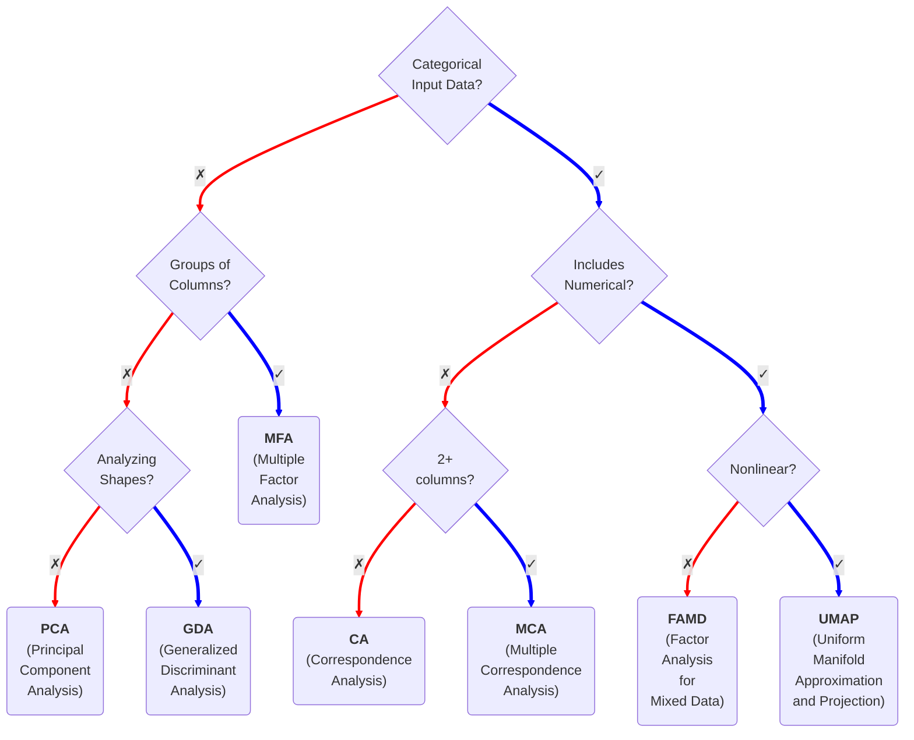

# Dimensionality Reduction

## Decision Tree
how to decide what kind of dimensionality reduction to apply based on your input data

### Methods Breakdown
- MFA  - Multiple Factor Analysis
- PCA  - Principal Component Analysis
- GDA  - Generalized Discriminant Analysis
- CA   - Correspondence Aanalysis
- MCA  - Multiple Correspondence Analysis
- FAMD - Factor Analysis of Mixed Data
- UMAP - [Uniform Manifold Approximation and Projection](https://en.wikipedia.org/wiki/Uniform_manifold_approximation_and_projection)
    - cross validation performance should reveal whether nonlinearities are present
    - it's a safe assumption that there will be nonlinearities in higher dimensional/complex data like visualization tasks. In those cases, preeferred to stuff like TruncatedSVD
    - doesn't give a sense of variance explained per dimension like linear methods do, so it will be harder to determine how much variance you've actually captured 
    - adds complexity due to the huge number of parameters
    - see [Understanding UMAP](https://pair-code.github.io/understanding-umap/)